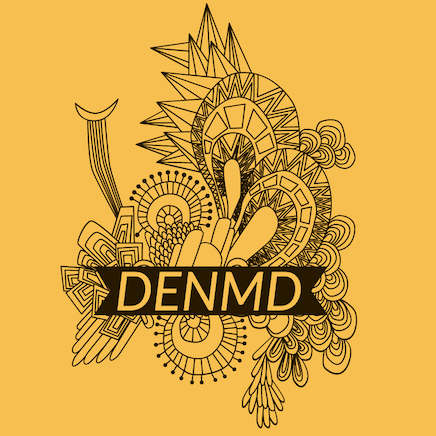

# Delay Embedding and Nonlinear Mutual Dynamics (DENMD) Toolbox
<!--  -->

<!-- 

 -->

A toolbox for generating higher-dimensional manifolds of time-series data using delay embedding methods and measuring nonlinear mutual dynamics between manifolds using cross mapping techniques.

## Overview

We've employed dynamical systems approaches to compile a toolbox that:
1. performs dynamical embedding of a time series to assay complexity and determine meaningful dimensions of activity
2. parsing of linear and nonlinear dynamics
3. assay causal asymmetry in reciprocal interactions between correlated signals
